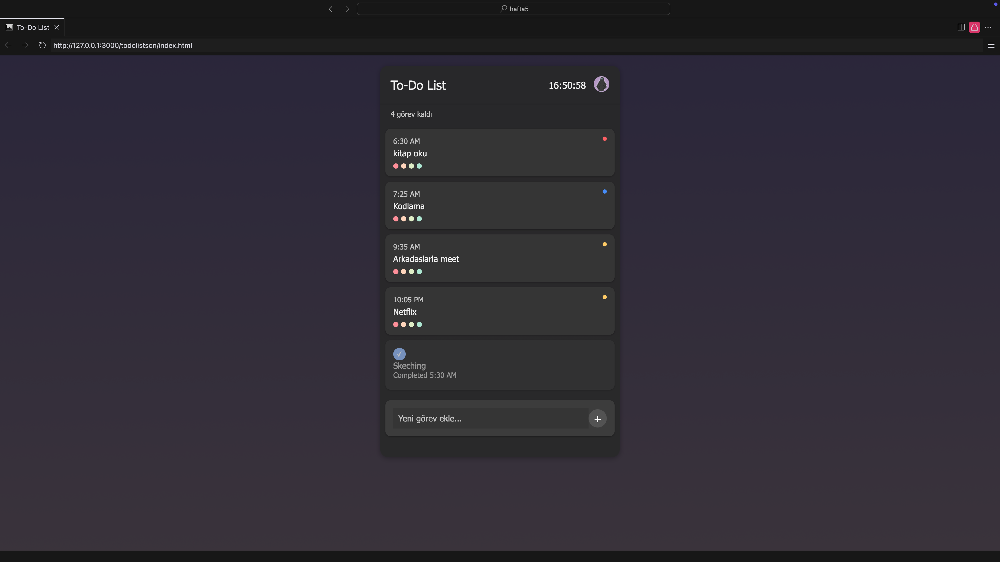
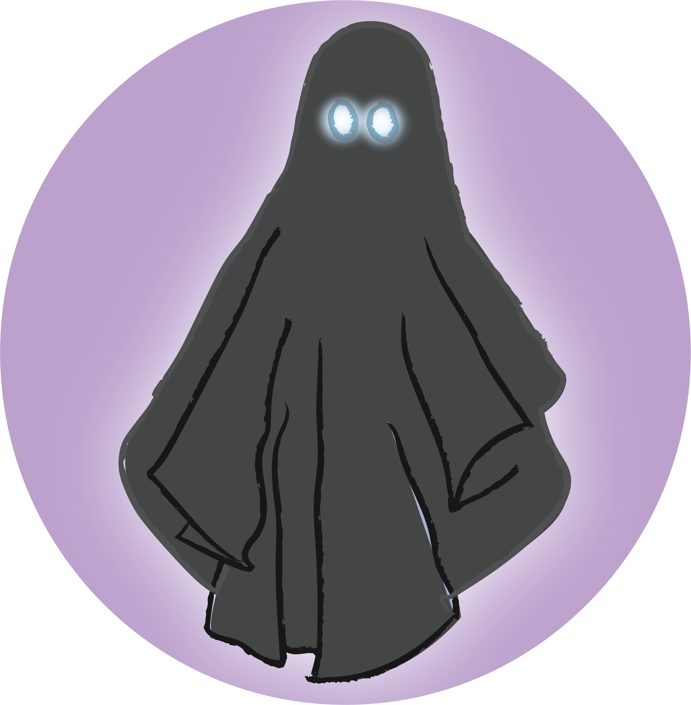

**📌 To-Do List Uygulaması**

**📖 Proje Hakkında**

Bu proje, modern bir **To-Do List** uygulamasıdır. Kullanıcıların günlük görevlerini kolayca ekleyip yönetmesine, tamamladıkları görevleri işaretlemesine ve kalan görevleri takip etmesine olanak tanır. Ayrıca, **canlı saat** ve **karanlık/açık tema değişimi** gibi özellikler ile kullanıcı deneyimini iyileştiren interaktif bir arayüze sahiptir.

**🎯 Özellikler**

✅ **Canlı Saat:** Anlık olarak güncellenen saat görüntüleme özelliği.

✅ **Tema Değiştirme:** Karanlık ve açık tema arasında geçiş yapabilme.

✅ **Dinamik Görev Yönetimi:** Görevleri ekleyebilir, tamamlanmış olarak işaretleyebilir ve durumlarını değiştirebilirsiniz.

✅ **Şık ve Kullanıcı Dostu Arayüz:** Minimalist ve etkileyici bir tasarım.

**🛠 Kullanılan Teknolojiler**

**	**•**	****HTML5** → Sayfanın yapısal iskeleti.

**	**•**	****CSS3** → Şık ve modern stil tasarımları.

**	**•**	****JavaScript** → Dinamik görev yönetimi ve etkileşimler.

**🚀 Kurulum ve Kullanım**

**	**1.**	**Proje dosyalarını bilgisayarınıza **indirin** veya **klonlayın**.

**	**2.**	**index.html dosyasını çift tıklayarak veya tarayıcınızda açarak çalıştırın.

**	**3.**	****Görevlerinizi ekleyerek uygulamayı kullanmaya başlayabilirsiniz!**

**🎨 Tasarım & Görseller**

Projede kullanılan görseller **Adobe Illustrator ve Adobe Photoshop** ile özel olarak tasarlanmıştır.

**	**•**	****background.png** → Arka plan görseli **(Illustrator ile tasarlandı).**

**	**•**	****casperL.png** → Açık tema ikon görseli **(Illustrator ile tasarlandı).**

**	**•**	****casperN.png** → Koyu tema ikon görseli **(Illustrator ile tasarlandı).**
## 🌙 Tema Görünümleri

**Açık Tema Görünümü:**


**Koyu Tema Görünümü:**



## 🌙 Tema Görünümleri

**Açık Tema Görünümü:**


**Koyu Tema Görünümü:**


*

```**📁


```

/to-do-list
│
├── index.html       # Ana HTML dosyası.
├── styles.css       # Stil (CSS) dosyası.
├── background.png   # Arka plan görseli.
├── casperL.png      # Açık tema ikon görseli.
├── casperN.png      # Koyu tema ikon görseli.
└── README.md        # Proje dökümantasyonu.

```
**🎭 Katkıda Bulunma**

Projeye katkıda bulunmak isterseniz, **fork** yaparak geliştirebilir ve **pull request** gönderebilirsiniz.

**📜 Lisans**

Bu proje **MIT Lisansı** ile lisanslanmıştır. Dilediğiniz gibi kullanabilir, geliştirebilir ve paylaşabilirsiniz.

**📩 İletişim**

📧 Herhangi bir sorunuz, öneriniz veya geliştirme fikriniz varsa **[mrtndn25@gmail.com]** üzerinden benimle
iletişime geçebilirsiniz!
```
